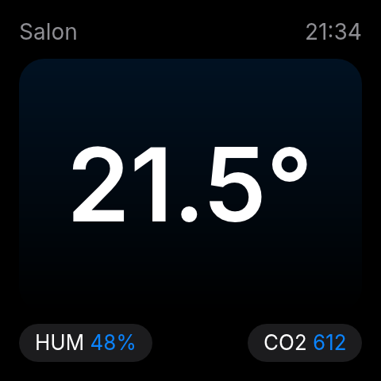
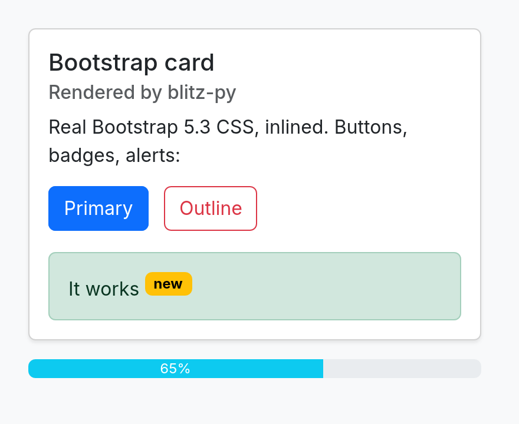
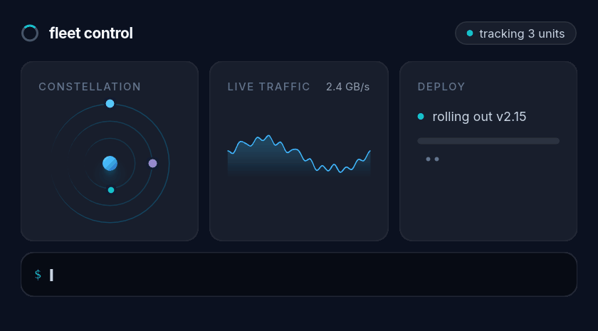

# blitz-py

[](https://github.com/adrienbrault/blitz-py/actions/workflows/ci.yml)
[](https://pypi.org/project/blitz-py/)

Render HTML/CSS to images from Python — no browser, no GPU, no JavaScript, no network.

Powered by [Blitz](https://github.com/DioxusLabs/blitz), DioxusLabs' modular web engine: real CSS via [Stylo](https://github.com/servo/stylo) (Servo/Firefox's style engine), flexbox/grid layout via [Taffy](https://github.com/DioxusLabs/taffy), text shaping via [Parley](https://github.com/linebender/parley), and CPU rasterization via [vello_cpu](https://github.com/linebender/vello).

A 240×240 widget renders in ~1.5ms warm on an M-series Mac (~40ms for the first render). Output is deterministic and identical across platforms: the [Inter](https://rsms.me/inter/) font (SIL OFL 1.1) is bundled as the default face, so text renders the same on your laptop and in a fontless Alpine container.

## What it looks like

<p align="center">
  
</p>
<p align="center">
  
  
</p>

Unedited `render_png` output: a [Tailwind v4](examples/tailwind_dashboard.html) dashboard (grid, SVG donut + sparkline, gradients, avatar stack), a [240×240 widget](examples/widget.py), and Bootstrap 5.3 components.

## Install

```
pip install blitz-py
```

Prebuilt wheels (abi3, Python ≥ 3.10): Linux glibc + musl (x86_64, aarch64), macOS (arm64, x86_64), Windows (x64).

## Usage

```python
import blitz_py

png = blitz_py.render_png(
    """
    <style>
      body { margin: 0; background: #000; color: #fff; font-family: sans-serif; }
      .screen { display: flex; flex-direction: column; align-items: center;
                justify-content: center; height: 240px; }
      .temp { font-size: 64px; font-weight: 600; }
      .label { color: #8e8e93; }
    </style>
    <body><div class="screen">
      <div class="temp">21.5&deg;</div>
      <div class="label">Living room</div>
    </div></body>
    """,
    width=240,
    height=240,
)
with open("out.png", "wb") as f:
    f.write(png)
```

Or get raw pixels for [Pillow](https://pillow.readthedocs.io/):

```python
from PIL import Image

w, h, rgba = blitz_py.render_rgba(html, width=240, height=240)
Image.frombytes("RGBA", (w, h), rgba).convert("RGB").save("out.jpg", quality=90)
```

## Animated GIFs

<p align="center">
  
</p>

Everything above is Tailwind classes + CSS `@keyframes` ([source](examples/mission_control.html)): satellites on different orbital periods, a live-scrolling traffic chart (a periodic series drawn two cycles wide, translated one cycle per loop — new data appears to stream in), an indeterminate progress sweep, and a `steps()`-driven typewriter — 48 frames rendered in ~220ms, seamless 4s loop.

CSS animations are evaluated on a deterministic clock: `render_frames` renders the document at any list of timestamps (seconds), and Pillow assembles the GIF. Frames after the first reuse the parsed document, so they're fast — ~1ms per 240×240 frame:

```python
from PIL import Image

fps, seconds = 12, 3.2
w, h, frames = blitz_py.render_frames(
    html, width=240, height=240,
    times=[i / fps for i in range(int(fps * seconds))],
)
rgbs = [Image.frombytes("RGBA", (w, h), f).convert("RGB") for f in frames]
base = rgbs[0].quantize(colors=64, dither=Image.Dither.NONE)
imgs = [im.quantize(colors=64, palette=base, dither=Image.Dither.NONE) for im in rgbs]
imgs[0].save("widget.gif", save_all=True, append_images=imgs[1:],
             duration=int(1000 / fps), loop=0, optimize=True)
```

Anything `@keyframes` can express — transforms, opacity, colors — loops perfectly because you control the clock. See [examples/animated_widget.py](examples/animated_widget.py).

File-size tips (a 3.2s 240×240 widget loop, measured): one **shared palette** across frames and **no dithering** matter most — both per-frame palettes and dither noise defeat GIF's delta/LZW compression. Naive 20fps/256-color/dithered ≈ 163KB; 20fps/64-color shared/no-dither ≈ 26KB; 12fps ≈ 18KB; 8fps/32 colors ≈ 11KB. Flat-color UI animation quantizes to 64 colors with no visible loss; gradients are what eat palette entries.

## Fast repeated renders: `Template`

For dashboards and device widgets that re-render the same document with fresh data, parse once and mutate by element `id`:

```python
tpl = blitz_py.Template(html, width=240, height=240)
tpl.set_text("temp", "21.5°")            # element must hold one text node
tpl.set_style("bar", "width", "62%")
tpl.set_attribute("icon", "src", data_uri)
png = tpl.render_png()                    # ~0.4ms — 3x faster than one-shot
frame = tpl.render_png(time=0.5)          # animation clock also available
```

Templates are safe to share across threads (the document lives on its own worker thread), and renders release the GIL — 4 rendering threads get ~3.5× throughput.

## API

Three functions and a class, same keyword arguments:

```python
render_png(html, *, width, height=None, ...) -> bytes       # PNG; height=None → content height
render_rgba(html, *, width, height=None, ...) -> (w, h, bytes)   # raw RGBA pixels
render_frames(html, *, width, height, times, ...) -> (w, h, [bytes, ...])  # animation frames
Template(html, *, width, height, ...)                       # parse once, re-render fast
```

| Argument | Default | Meaning |
|---|---|---|
| `width`, `height` | required | CSS-pixel viewport size |
| `scale` | `1.0` | Device-pixel ratio; output is `width*scale` × `height*scale` physical pixels. Use `2.0` for supersampled/hi-dpi output. |
| `color_scheme` | `"light"` | `"light"` or `"dark"` — drives `@media (prefers-color-scheme: ...)` |
| `background` | `"#ffffff"` | Base canvas color (`#rgb`, `#rrggbb`, `#rrggbbaa`), or `None` for transparent |
| `base_url` | `None` | Base for resolving relative URLs |
| `css` | `None` | Extra CSS appended after the document's styles (wins the cascade) |
| `css_vars` | `None` | Dict of CSS custom properties set on `:root`, e.g. `{"accent": "#f00"}` → `var(--accent)` |
| `fonts` | `None` | List of font file `bytes` (TTF/OTF, variable fonts OK) to register |
| `default_font_family` | `None` | Family name to use for all CSS generic families (`sans-serif`, `serif`, ...) and as text fallback |
| `allow_file_urls` | `False` | Permit `file://` URLs for images/resources |

### Images and resources

Rendering is fully offline. Embed images as `data:` URIs, or enable `allow_file_urls=True` and use `file://` paths. `http(s)` URLs are intentionally ignored.

```python
import base64
b64 = base64.b64encode(open("icon.png", "rb").read()).decode()
html = f''
```

### CSS frameworks (Bootstrap, Tailwind, ...)

Any framework that ships as plain CSS works — inline it in a `<style>` tag:

```python
css = open("bootstrap.min.css").read()  # fetch/cache it however you like
html = f"<style>{css}</style><body class='p-4'><div class='card'>...</div></body>"
```

Bootstrap 5 components (cards, buttons, badges, alerts, progress bars) render correctly. For Tailwind, run its build step and inline the generated CSS — the JS "Play CDN" won't work because there is no JavaScript engine. JS-driven behavior (modals opening, dropdowns) doesn't apply to static rendering anyway.

### Fonts

Bundled Inter is the default for every CSS generic family and the Latin-script fallback, everywhere. Explicit family names (`font-family: "Comic Sans MS"`) resolve against system fonts where available (macOS/Windows natively; Linux via fontconfig loaded at runtime if present — never a link dependency). To use your own font:

```python
font = open("MyFont.ttf", "rb").read()
blitz_py.render_png(html, width=240, height=240,
                    fonts=[font], default_font_family="My Font")
```

`@font-face` also works with `data:` (or `file://`) sources — state the format explicitly, either as the unquoted CSS keyword or a bare extension string:

```css
@font-face {
  font-family: MyWebFont;
  src: url(data:font/ttf;base64,...) format(truetype);  /* or format("ttf") */
}
```

WOFF/WOFF2 sources are supported too. `local(...)` sources and format-less data URIs are currently skipped by the engine.

Note on coverage: bundled Inter covers Latin scripts (plus Greek/Cyrillic). For CJK, Arabic, and other scripts on systems without suitable fonts, pass an appropriate font (e.g. a Noto variant) via `fonts=`.

### What's supported

Modern CSS as implemented by Stylo/Taffy: flexbox, grid, gradients, border-radius, shadows, transforms, `calc()`, custom properties, media queries, SVG images, WOFF... No JavaScript, no `@font-face` fetching, no external resources. Blitz itself is pre-1.0: capable but not pixel-perfect against browsers.

## Performance

Measured on an M-series Mac (arm64), each scenario in a fresh process, release build — reproduce with [examples/bench.py](examples/bench.py):

| Scenario | Output px | First render | Warm render | Peak RSS after 200 renders |
|---|---|---:|---:|---:|
| `<h1>Hello</h1>` | 200×100 | 35ms | **0.5ms** | 42MB |
| 240×240 widget @2× (flex + gradients) | 480×480 | 32ms | **1.8ms** | 45MB |
| Bootstrap 5.3 card (233KB CSS) | 880×720 | 39ms | **8.2ms** | 51MB |
| Tailwind v4 dashboard (the gallery image) | 1520×1328 | 60ms | **22ms** | 62MB |
| Long article | 800×4000 | 56ms | **21ms** | 73MB |
| Animated GIF: widget, 38 frames | 240×240×38 | 56ms total | **1.5ms**/frame | 76MB |

GIF encoding on top of rendering (Pillow quantize + LZW, 38 frames): ~60ms, 18KB output.

More performance properties, all verified in CI or by `examples/bench.py`:

- **`Template` re-renders in ~0.4ms** (parse and first style pass amortized away).
- **Thread scaling**: the GIL is released during rendering; 4 threads → ~3.5× throughput.
- **Deterministic across platforms**: CI renders a golden set on Linux, macOS, and Windows and asserts the outputs are byte-identical. Snapshot tests in your project can compare exact hashes.
- Package ships type stubs (`py.typed`), so the API autocompletes and type-checks.

The first render pays a one-time system-font scan; after that the font collection is cached and cloned per render. Importing the module adds ~1MB RSS; memory stays flat under sustained rendering (no per-render growth — verified over 1000+ renders). On an Alpine/arm64 container the warm widget render measures ~0.8ms.

The GIL is released during rendering, so concurrent renders from Python threads scale and async event loops aren't blocked.

## Why not a headless browser?

Playwright/Chromium render HTML too — at ~150MB+ of install, a browser process to babysit, and cold starts in the hundreds of milliseconds. blitz-py is a ~7MB self-contained wheel with millisecond renders, suitable for embedded targets like Home Assistant integrations generating widget images for small displays (its original use case).

## License

MIT OR Apache-2.0. Bundled Inter font: SIL OFL 1.1 ([assets/LICENSE-Inter.txt](assets/LICENSE-Inter.txt)).
